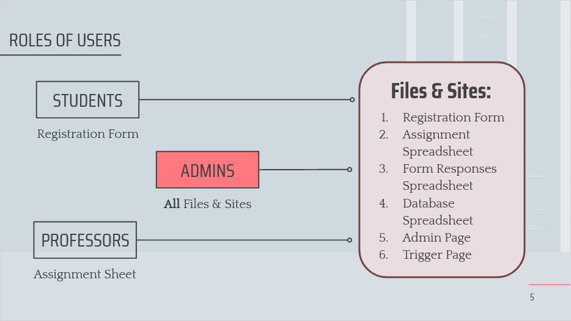
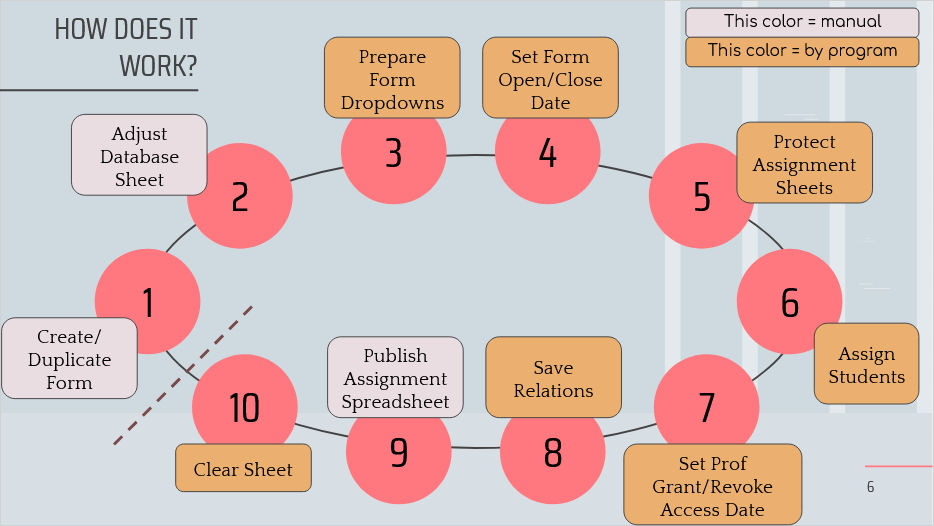

# University Student-to-Supervisor Thesis Assigner

## Description

A Google App Script program to help the assignment process of thesis students to their supervisors using Google Spreadsheet and Google Form.

This application was a project for Maranatha Christian University (Universitas Kristen Maranatha), Faculty of Medicine. This project mainly aims to address some common problems in student-to-professor thesis assignment process:

1. Uncontrollable timeline of  the conventional way; resulting in unfair “races”

2. Fully booked supervisors are still flooded by student requests

### Roles and Files

There are 3 types of user/role with 6 involved files:

* Roles
    1. Student
    2. Professor
    3. Admin
* Files
    1. Registration Form
    2. Assignment Spreadsheet
    3. Form Responses Spreadsheet
    4. Database Spreadsheet
    5. Admin Page
    6. Trigger Page

### Usage Flow

Here is how you can use the program. The flow consists of 10 steps:

## License
Copyright © 2021, Ferdiant Joshua Muis. Released under [MIT License](./LICENSE).
